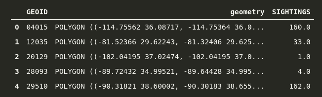

# Exercise 3

Now will practice how to do geocoding and spatial joins in Geopandas. The overall aim of this exercise to find where UFO appears most often.

This example merges sightings of unidentified flying objects [compiled by the National UFO Reporting Center](https://github.com/planetsig/ufo-reports) with the outline of U.S. counties. It then analyzes what counties have reported the most sightings per capita.

The credit for this idea goes to [Ben Welsh](mailto:ben.welsh@gmail.com).
## Sections

 - [Problem 1: Understanding UFO sightings](#problem-1-understanding-ufo-sightings)
 - [Problem 2: Geocode military bases](#problem-2-geocode-military-bases)
 - [Problem 3: Add population data](#problem-3-add-population-data)

You can write all your codes into the same script called `spatial_queries.py`.

## Problem 1: Understanding UFO sightings

**Steps**
- Read into memory data on UFO events from `data/ufo/ufo-scrubbed-geocoded-time-standardized.csv`. Store them in `events` GeoDataFrame.
- Convert latitude and longitude to shapely Points, and add them to the `events`
- Set coordinate reference system on `events` to `epsg:4269`
- Read into memory US counties data from `data/ufo/cb_2016_us_county_5m.shp`. Store them in `counties` GeoDataFrame.
- Check the CRS on `counties`. Align the CRS in `counties` and `events`.
- Calculate number of sightings in each county. Store your results in `sightings_per_county` GeoDataFrame. The relevant columns in resulting dataframe will look like:



- Limit your results to contitnental US. Use this code:
```
continental_us = shapely.geometry.box(-124.848974, 24.396308, 66.885444, 49.384358)
sightings_per_county = sightings_per_county[
    sightings_per_county.geometry.intersects(continental_us)
]
```
- Plot the sightings per county

## Problem 2: Geocode military bases

The goal of this exercise is to geocode locations of US airforce bases, and add them to the UFO sightings map.

**Steps**
- Read into memory data on airforce military bases from `data\UFO\airforce_bases.csv`
- For each row, create address string
- Geocode the addresses in geopandas.
- Reproject the geometries into the same EPSG projection as in your main GeoDataFrame
- Plot the geocoded addresses on them map. Can you add them to the maps you created previously?
- Save the geocodes as a Shapefile called `military_bases.shp`

*Hint*: If you have issues with geocoding, try simplifying your address string. Create address string using "Location" and "State" columns only

## Problem 3: Add population data

The absolute number of sightings may be misleading. All in all, it depends not only on UFOs passing by, but also on the number of people who have a chance to see it. To account for it, let's include population data into our analysis.

**Steps**
- Read into memory census data from `data\UFO\PST045214.csv`
- Merge it with `sightings_per_county` GeoDataFrame. Use ``GEOID` as a county identifier.
- Plot popluation per county. How does it compare to your sightings map from Problem 1?

Now, let's adjust the sightings for population size:
- For each county, calculate `sightings_per_capita`: number of sightings, divided by number of people
- Plot the sightings per capita
- Add geocoded addressess from [problem 2](#problem-2-geocode-military-bases)
- Save the your results to `ufo_sightings.shp` file

What can you conclude from this map?
